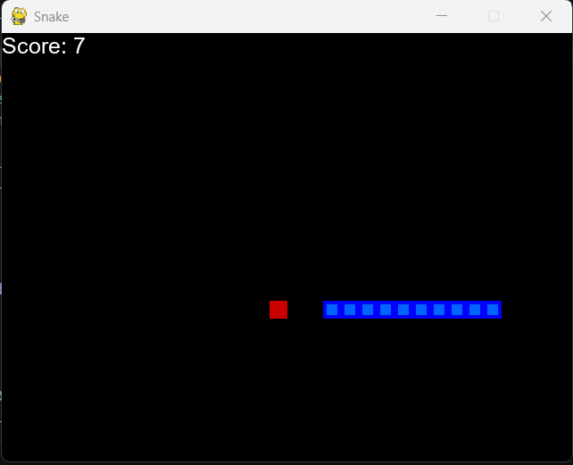
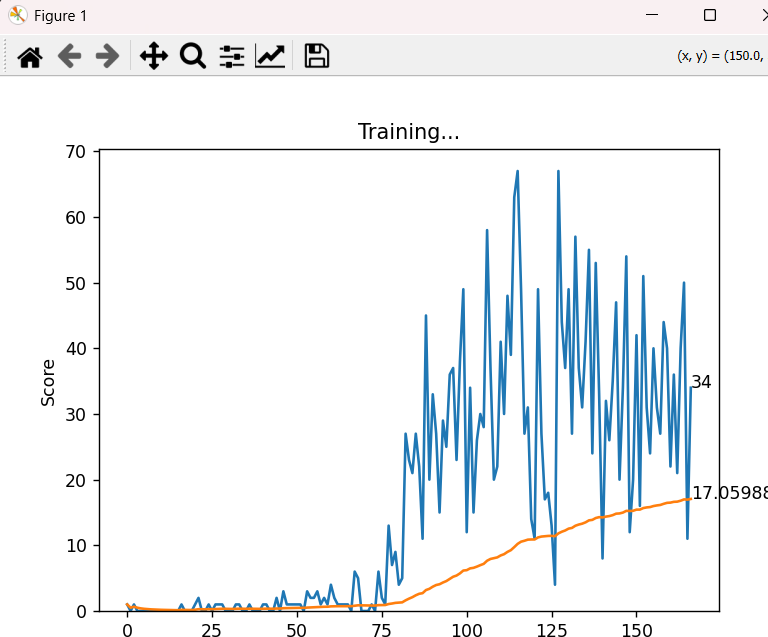

# 🐍 Snake Game AI

An intelligent Snake game powered by **Deep Q-Learning** and **PyTorch**. Watch as the AI agent learns to navigate the game board, avoid obstacles, and maximize its score through reinforcement learning.

---

##  Features

✅ **AI-Powered Agent** - Uses Deep Q-Learning (DQN) to learn optimal gameplay  
✅ **Real-time Visualization** - Live training plots showing score progression  
✅ **Neural Network** - 2-layer network with 256 hidden units  
✅ **Smart State Representation** - 11-feature state space capturing danger zones and food location  
✅ **Automatic Model Saving** - Saves best model when record scores are achieved  
✅ **Memory & Experience Replay** - 100k experience buffer for efficient learning  

---

##  Gameplay Demo

<div align="center">

**AI Agent Playing Snake**



*Score: 7 - The agent learning to navigate the game board*

</div>

---

##  Training Progress

<div align="center">

**Learning Curve Over 150+ Games**



*Blue line: Individual game scores | Orange line: Average score trend*  
*The AI progressively learns to achieve higher scores through reinforcement learning*

</div>

---

##  How It Works

### State Space (11 Features)
The agent observes the game state as a vector of 11 binary/numeric features:

| Feature | Description |
|---------|-------------|
| Danger Straight | Collision ahead in current direction |
| Danger Right | Collision to the right |
| Danger Left | Collision to the left |
| Direction (4 features) | Current movement direction (L, R, U, D) |
| Food Position (4 features) | Relative location of food (L, R, U, D) |

### Action Space (3 Actions)
- **0**: Continue straight
- **1**: Turn right
- **2**: Turn left

### Reward System
- **+10** - Eating food (score increase)
- **0** - Normal move
- **-10** - Collision (game over)

### Neural Network Architecture
```
Input (11) → Hidden (256) → Output (3)
         ReLU        Linear + Q-values
```

---

##  Installation

### Prerequisites
- Python 3.7+
- pip or conda

### Setup

1. **Clone the repository**
```bash
git clone https://github.com/YOUR_USERNAME/snake-pygame.git
cd snake-pygame
```

2. **Create virtual environment** (recommended)
```bash
python -m venv venv
source venv/bin/activate  # On Windows: venv\Scripts\activate
```

3. **Install dependencies**
```bash
pip install -r requirements.txt
```

---

##  Usage

### Train the AI Agent
```bash
python agent.py
```

This will:
- Initialize a new agent and game
- Train the agent over multiple episodes
- Display real-time training progress with live plots
- Automatically save the best model to `model/model.pth`

### Run Trained Agent (Manual Testing)
```bash
python snake_game.py
```

---

## 📁 Project Structure

```
snake-pygame/
├── agent.py              # DQN Agent implementation
│   ├── get_state()       # Extract state features
│   ├── get_action()      # Epsilon-greedy policy
│   ├── train_long_memory()   # Batch training
│   └── train_short_memory()  # Single step training
├── snake_game.py         # Game environment & PyGame logic
├── model.py              # Neural network architecture
├── helper.py             # Plotting utilities
├── model/
│   └── model.pth         # Trained model weights
├── assets/
│   ├── gameplay.png      # Gameplay screenshot
│   └── training_plot.png # Training visualization
├── requirements.txt      # Python dependencies
└── README.md             # This file
```

---

##  Hyperparameters

| Parameter | Value | Description |
|-----------|-------|-------------|
| `MAX_MEMORY` | 100,000 | Experience replay buffer size |
| `BATCH_SIZE` | 1,000 | Training batch size |
| `LEARNING_RATE` | 0.001 | Optimizer learning rate |
| `GAMMA` | 0.9 | Discount factor |
| `EPSILON` | 80 - n_games | Exploration factor (decreases over time) |

---

##  Training Details

**Exploration Strategy:** Epsilon-Greedy
- Early games: More random moves (high epsilon)
- Later games: More model-driven decisions (low epsilon)
- Helps balance exploration vs exploitation

**Memory System:**
- Stores last 100,000 experiences
- Samples random batch for training (experience replay)
- Prevents overfitting to recent games

---

##  Performance Metrics

The agent achieves:
- **Initial Average Score:** ~2-3
- **After 50 games:** ~10-15
- **After 150 games:** ~15-20+
- **Record Score:** Varies based on training (can exceed 50+)

---

##  Technologies Used

| Technology | Purpose |
|------------|---------|
| **PyTorch** | Deep Learning framework |
| **Pygame** | Game rendering & interaction |
| **NumPy** | Numerical computations |
| **Matplotlib** | Real-time training visualization |

---

##  Future Improvements

- [ ] Dueling DQN for better value estimation
- [ ] Prioritized experience replay
- [ ] Policy gradient methods (A3C, PPO)
- [ ] GUI for interactive training control
- [ ] Save/load training checkpoints
- [ ] Multiple AI agents comparison
- [ ] Tensorboard integration for logging

---

##  Algorithm Overview

This project implements **Deep Q-Learning (DQN)** from the paper:
> *"Playing Atari with Deep Reinforcement Learning"* (Mnih et al., 2013)

**Key Components:**
1. **Q-Network**: Maps states to action values
2. **Experience Replay**: Breaks temporal correlations
3. **Target Network**: Stabilizes training (optional extension)
4. **Epsilon-Greedy Exploration**: Balances learning and exploitation

---

## Contributing

Contributions are welcome! Feel free to:
- Report bugs
- Suggest improvements
- Submit pull requests

---

## License

This project is licensed under the **MIT License** - see the LICENSE file for details.

---

## Author

Created as a Deep Reinforcement Learning project.

---

<div align="center">

**Made with  using PyTorch & Pygame**

[Star this repo](#) if you found it helpful! ⭐

</div>
